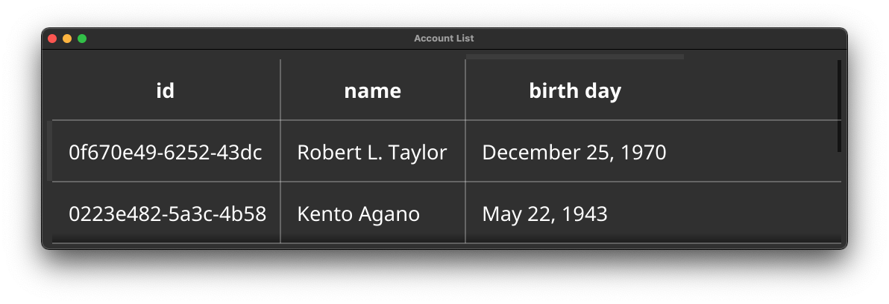

# fyne-datatable

```go
package main

import (
	"fyne.io/fyne/v2"
	"fyne.io/fyne/v2/app"
	"fyne.io/fyne/v2/container"

	datatable "github.com/micheam/fyne-datatable/v2"
)

type account struct {
	ID       string `column:"id"`
	Name     string `column:"name"`
	Phone    string `column:"-"` // ignore 
	Birthday string `column:"birth day"`
}

func main() {
	a := app.New()
	w := a.NewWindow("Account List")
	data := []account{
		{"0f670e49-6252-43dc", "Robert L. Taylor", "706-767-8575", "December 25, 1970"},
		{"0223e482-5a3c-4b58", "Kento Agano", "936-347-9392", "May 22, 1943"},
		{"311cec67-fc48-4bb3", "Mahito Fujiwara", "574-282-4340", "July 27, 1983"},
		{"34977adb-783a-49db", "Suzanne R. Gonzalezxxxxxxxxxxx", "603-736-6867", "June 12, 1994"},
		{"0b809125-abaf-423b", "Linda M. Bailey", "317-738-7776", "January 2, 1962"},
	}
	sample := data[0]
	table := datatable.New(sample, data)
	w.SetContent(container.NewMax(table))
	w.Resize(fyne.NewSize(600, 150))
	w.ShowAndRun()
}
```

```shell
$ go run main.go
```

this will show screen below:


